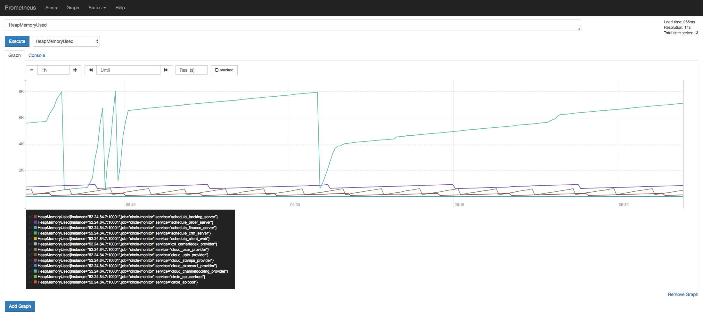
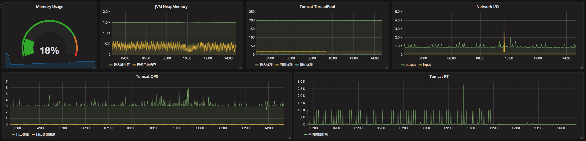
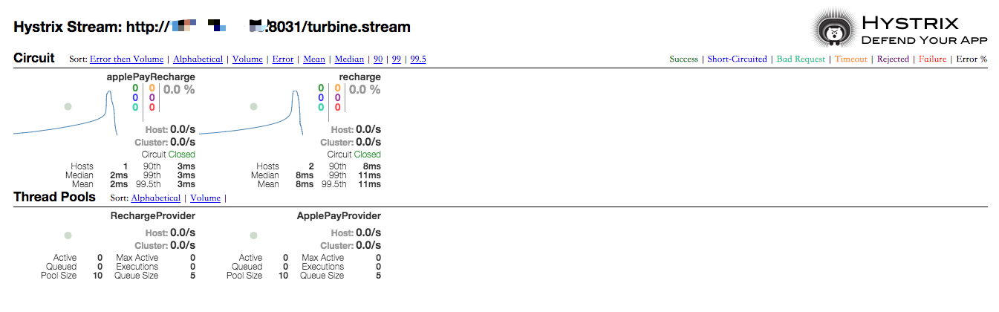
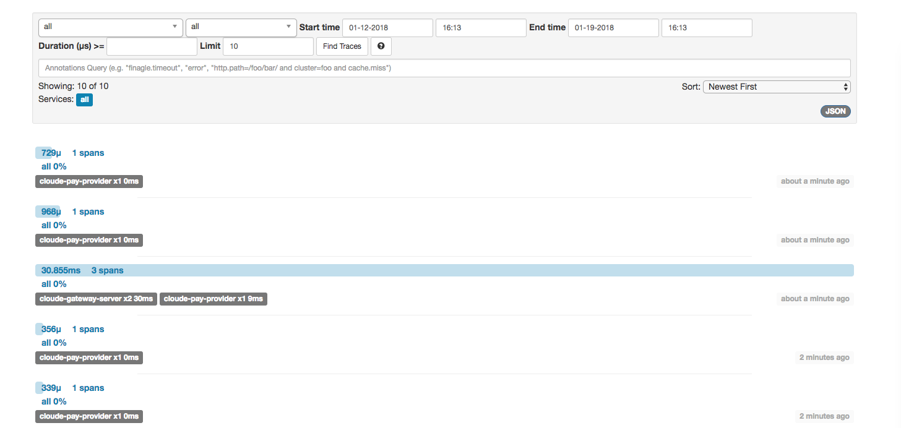
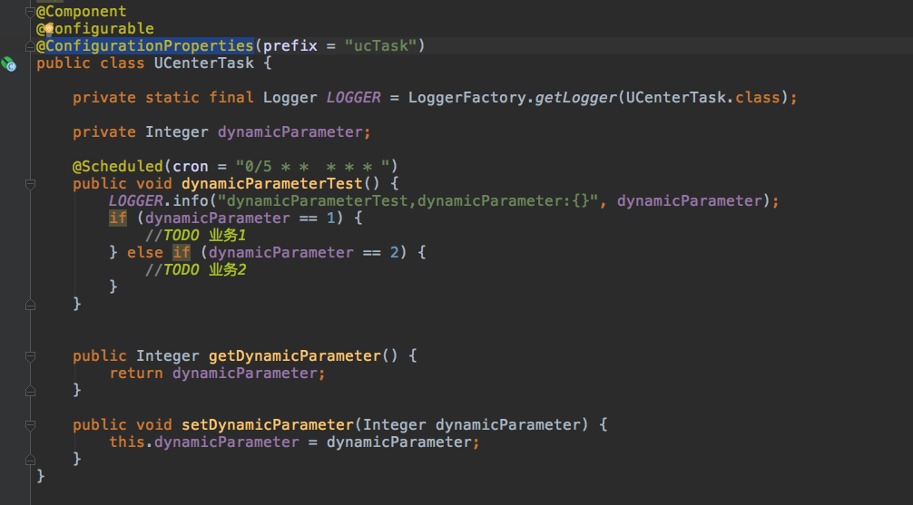
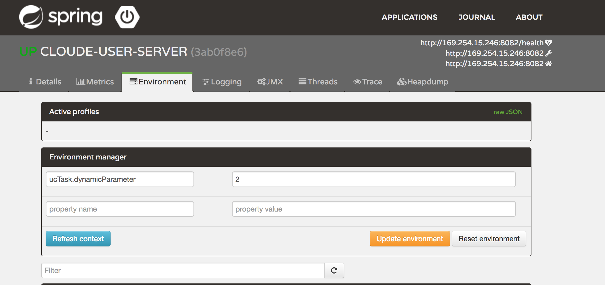

## 项目介绍

　　基于spring cloud的分布式系统架构。提供整套的微服务组件，包括服务发现、服务治理、链路追踪、服务监控等。所有服务均支持在docker中运行。


### 组织结构

``` lua
cloudE
├── cloudE-eureka-server -- 服务发现
├── cloudE-config-server -- 分布式配置中心
├── cloudE-config-repo -- 配置文件
├── cloudE-admin-server -- 服务监控
├── cloudE-gateway-server -- zuul网关
├── cloudE-hystrix-dashboard-server -- hystrix仪表盘
├── cloudE-turbine-server -- hystrix仪表盘聚合服务
├── cloudE-zipkin-server -- 链路监控
├── cloudE-pay-api -- 支付服务api，提供feign接口
├── cloudE-pay-provider -- 支付服务
├── cloudE-ucenter-provider -- 用户中心
├── cloudE-mapper -- mybatis生成模块
├── cloudE-common 公共模块、工具类等
```

### 技术选型

技术 | 说明 | 官网
----|------|----
Spring cloud eureka | 云端服务发现，一个基于 REST 的服务，用于定位服务，以实现云端中间层服务发现和故障转移。 | [https://projects.spring.io/spring-cloud/](https://projects.spring.io/spring-cloud/)
Spring cloud config server | 让你可以把配置放到远程服务器，集中化管理集群配置，目前支持本地存储、Git以及Subversion  | [https://projects.spring.io/spring-cloud/](https://projects.spring.io/spring-cloud/)
Spring cloud zuul | Zuul 是在云平台上提供动态路由,监控,弹性,安全等边缘服务的框架  | [https://projects.spring.io/spring-cloud/](https://projects.spring.io/spring-cloud/)
Spring Cloud Sleuth | 日志收集工具包，封装了Dapper和log-based追踪以及Zipkin和HTrace操作，为SpringCloud应用实现了一种分布式追踪解决方案。 | [https://projects.spring.io/spring-cloud/](https://projects.spring.io/spring-cloud/)
Spring boot admin | 服务监控  | [http://projects.spring.io/spring-boot/](http://projects.spring.io/spring-boot/)
Hystrix | 熔断器，容错管理工具，旨在通过熔断机制控制服务和第三方库的节点,从而对延迟和故障提供更强大的容错能力。 | 
Hystrix-dashboard | hystrix 仪表盘 
zipkin | 分布式链路调用监控系统，聚合各业务系统调用延迟数据，达到链路调用监控跟踪。 |
Turbine | 聚合服务器发送事件流数据的工具，用来监控集群下hystrix的metrics情况。
Feign | 一种声明式、模板化的HTTP客户端。
MyBatis Generator | 代码生成  | [http://www.mybatis.org/generator/index.html](http://www.mybatis.org/generator/index.html)
Redis | 分布式缓存数据库  | [https://redis.io/](https://redis.io/)
Log4J | 日志组件  | [http://logging.apache.org/log4j/1.2/](http://logging.apache.org/log4j/1.2/)
Swagger2 | 接口测试框架  | [http://swagger.io/](http://swagger.io/)
Maven | 项目构建管理  | [http://maven.apache.org/](http://maven.apache.org/)
prometheus | 时间序列数据库 | [https://prometheus.io/](https://prometheus.io/)

### 模块介绍

> cloudE-common

包含了公共模块，以及工具类等。

> cloudE-pay-api

支付服务api包，以feign的形式暴露支付接口

> cloudE-pay-provider

提供支付服务

> cloudE-ucenter-provider

用户中心，通过feign调用支付服务


### 环境搭建

> 开发环境

- 1、本机安装Jdk8、Mysql并**启动相关服务**，使用默认配置默认端口即可
- 2、克隆源代码到本地并打开，**推荐使用IntelliJ IDEA**

> 准备工作

- 创建数据库，导入cloudE-mapper项目中的create.sql

- 修改cloudE-config-repo中对应的配置信息（mysql）

> 启动服务

- 启动服务有三种方式：

- 1、执行spring boot main方法

- 2、执行maven打包命令 mvn clean install -Dmaven.test.skip=true ,jar包会被打到target目录下，进入该目录，执行 java -jar cloudE-xxxxx-xxxx.jar --spring.profiles.active=dev

- 3、构建docker镜像（mvn package docker:build），然后执行docker run xxxxx/xxxxx

> 启动顺序

- 优先启动cloudE-eureka-server,cloudE-config-server。其他服务顺序随意


### 服务监控

>  通过prometheus client暴露Metrics到/prometheus。然后通过简单的配置Prometheus，就可以采集到监控数据。还可以使用Grafana，更好的展示监控数据。
  
  下面放上两张监控的效果图：
- 1、prometheus

- 2、grafana

  
  另外，通过spring cloud生态内的hystrix dashboard,以及zipkin（链路监控），也可以很好的监控服务，排查问题
- 1、hystrix dashboard

- 2、zipkin
 


### 动态参数注入

>  有时候业务上需要用到可以热修改的参数，可以通过@RefreshScope注解，和spring boot admin来实现
    
   例子在cloudE-ucenter-provider中。实现如下：
- 1.在启动类上加上@RefreshScope注解
- 2.类中注入参数(参数配在properites中)

- 3.spring boot admin修改对应参数，即可实时生效



    


